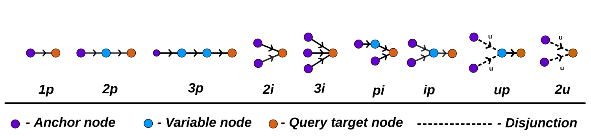

# Laboratorio di Intelligenza Artificiale - Francesco Resca

### Preparation

Launch this script to download dataset and pretrained models

```bash
./dataandmodel.sh
```

Prepare the conda environment for the gradient based method

```bash
conda create --name 2p-queries-project python=3.8 && conda activate 2p-queries-project
pip install -r requirements.txt
```


### Accorpamento e creazione dei fatti

Le terne <anchor,relation,target>, che caratterizzano il grafo, sono state suddivise nei file train.txt, valid.txt e test.txt.  
Sia le entità che le relazioni sono convenientemente caratterizzate da numeri identificativi univoci, ricavabili dai file ind2ent.pkl e ind2rel.pkl che contengono dizionari.  
Per effettuare query sul grafo ho deciso di partire strutturando i fatti come:  
```bash
t(anchor,relation,target)
```
I fatti vengono generati dallo script fact_generator_fromtxt.py. Il seguente comando produce il file prolog facts.pl contenente le terne del file train.txt:

```bash
python3 facts_generator_fromtxt.py facts.pl train.txt
```

Per ottenere il file prolog all_facts.pl contenente l'intero KG può essere utilizzato lo stesso script:

```bash
python3 facts_generator_fromtxt.py all_facts.pl train.txt valid.txt test.txt
```

### Query sul KG

Nel paper "Complex Query answering with Neural Link Predictors" vengono considerati 9 tipi di query sul KG:



Nel seguente paragrafo vi è una congettura derivante dall'osservazione dei file:  

Le query e i corrispondenti risultati corretti sono organizzati in tuple e si trovano in diversi file test_ans_\*.pkl, e caratterizzati dal tipo di query (1c,2c,3c,2i,3i,ci,ic,uc,2u).  
Vi sono inoltre file test_ans_\*_hard.pkl dove sono memorizzati solo i risultati delle query che non possono essere ottenuti solo considerando le triple del file train.txt.pkl e valid.txt, ma devono essere trovati individuando gli archi mancanti nel KG (sarebbero necessarie le terne del file test.txt).

### Query in Prolog

Nel file query.pl ho realizzato le tipologie di query come predicati prolog:
- query_c
- query_i
- query_ci
- query_ic
- query_u
- query_uc

### Primi tentativi di query

Prima di tutto è necessario convertire le query contenute nei file test_ans_*.pkl in prolog, per fare questo ho creato lo script "query_generator.py" al quale va passato il file che contiene le query che devono essere convertite in file prolog.

```bash
python3 queryp_generator.py <1c,2c,3c,2i,3i,ci,ic,2u,uc>
```

Per ogni tipologia di query sopracitata ho realizzato un predicato per calcolare il numero di risultati non trovati.  
Viene effettuata una 'sottrazione' tra i risultati contenuti nei file e quelli prodotti dalle query in prolog, restituendo i risultati che le mie query non sono in grado di prevedere.  
Contando quanti risultati sono liste vuote corrisponde a contare quante query sono state eseguite correttamente, questo viene fatto da apposti predicati "result".
Infine ho realizzato un predicato "test" che stampa a video il numero di query per ogni tipo e il corrispondente numero di previsioni corrette.  
Di seguito i deludenti risultati:

```bash
?- test.
1c: 67016 35827
2c: 8000 2364
3c: 8000 1304
2i: 8000 1328
3i: 8000 1328
ci: 8000 708
ic: 8000 1649
2u: 8000 2192
uc: 8000 1061
```

Per scrupolo ho provato ad utilizzare i file train.txt.pickle, valid.txt.pickle e test.txt.pickle presenti nella cartella 'data/FB15k/kbc_data' che mi ero accorto avere contenuto diverso da quello di test.txt, valid.txt e test.txt usati fino ad adesso.  
Eseguendo la stessa procedura di valutazione delle query ottengo i seguenti risultati:

```bash
?- test.
1c: 67016 67016
2c: 8000 8000
3c: 8000 8000
2i: 8000 8000
3i: 8000 8000
ci: 8000 8000
ic: 8000 8000
2u: 8000 8000
uc: 8000 3823
```